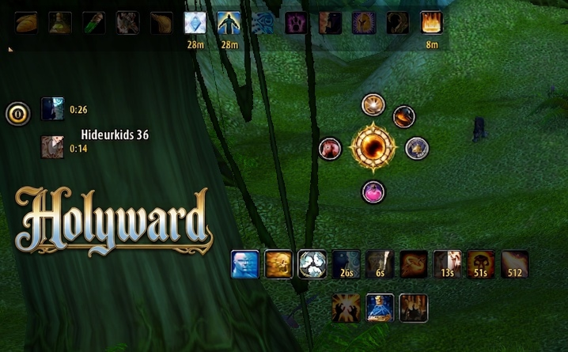
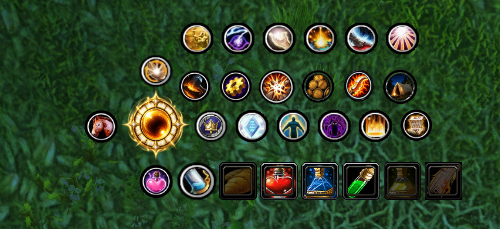
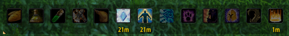
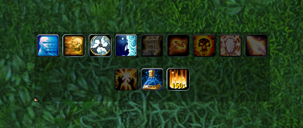
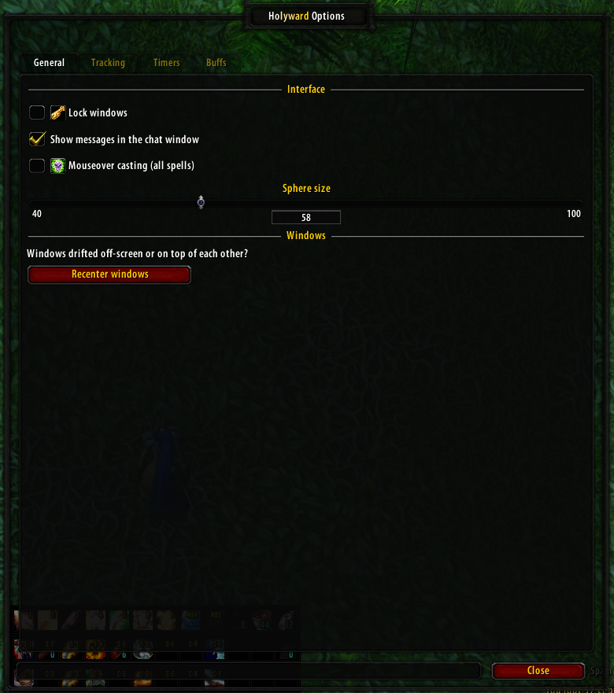
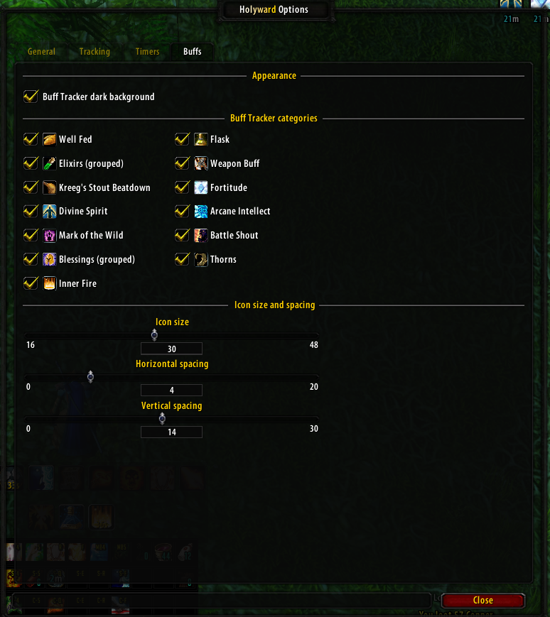
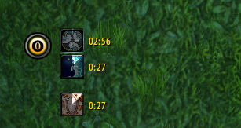

# Holyward

**An all-in-one Priest utility addon for TurtleWoW/OctoWoW.** One floating sphere, five
satellite menus, and two live trackers — everything a Priest needs to buff, heal, and manage
cooldowns without digging through the spellbook or juggling extra addons.

<!-- Hero screenshot: the sphere with satellites expanded, both trackers visible -->

## What it does

Holyward puts every Priest-specific tool one click away from a single draggable sphere:

- **Quick-cast menus** for buffs, utility spells, mounts, consumables, and professions —
  no digging through the action bar or spellbook.
- **Buff Tracker** — at-a-glance status of every raid/party buff you care about, with
  click-to-cast on the three you can refresh yourself (Fortitude, Divine Spirit, Inner Fire).
- **Ability Tracker** — a WeakAuras-style row of cooldowns, DoTs, and procs, fully
  drag-to-reorder and resizable.
- **Mouseover casting** for every spell on every action bar, rank-aware and safe under
  Nampower's spell queue if you have it installed.
- A settings window that looks and feels like it belongs on this client (dark AceConfig
  theme, not a stock Blizzard panel bolted on).

## Features

### The sphere
- Drag it anywhere on screen; it remembers its position.
- **Left-click** retracts/expands the five satellite buttons with a short slide-and-fade
  animation. **Right-click** opens the settings window.
- Configurable size (Options → General).
- Visually swaps between a Holy/Discipline skin and a Shadow skin automatically when you
  shift into Shadowform.

### Satellite menus
Five buttons orbit the sphere, each opening a chained popup of icons:

| Button | Opens |
|---|---|
| Buffs | Fortitude, Divine Spirit, Arcane Intellect-tier group buffs, Inner Fire, Shadowform, Enlighten |
| Utility | Fear Ward, Mind Soothe, Levitate, Lightwell, Resurrection, Mind Vision |
| Mount | Your fastest known mount (right-click for Hearthstone) |
| Consumables | Best water/food/potions/bandage currently in your bags, auto-detected |
| Professions | Every profession/secondary-skill quick-use spell in your spellbook (Cooking, First Aid, Fishing, Smelting, Find Minerals, etc.) |

<!-- Screenshot: satellite menus expanded, showing a couple of the popups open -->

### Buff Tracker
A row of icons for the raid/class buffs a Priest cares about: Well Fed, Flask, Elixirs
(grouped, right-click to expand into the individual buffs), weapon enchant, Kreeg's Stout
Beatdown, Fortitude, Divine Spirit, Arcane Intellect, Mark of the Wild, Battle Shout,
Paladin Blessings (grouped, same right-click expand), Thorns, and Inner Fire. Gray means
missing, colored means active, with a countdown to expiration. Hover any icon for its real
tooltip; click Fortitude/Divine Spirit/Inner Fire to cast them directly from the tracker.
<!-- Screenshot: Buffs tracker -->

### Ability Tracker
Seventeen configurable slots covering every Priest cooldown, DoT, and proc worth watching at a
glance: Fade, Fear Ward, Power Infusion, Inner Focus, Pain Spike, Psychic Scream, Chastise,
Ascendance, Enlighten, Shackle Undead, Weakened Soul, Devouring Plague, Shadow Word: Pain,
Purifying Flames, Searing Light, Mana Potion, and Inner Fire. Drag icons to reorder them,
resize the whole tracker from the corner grip, and toggle individual slots off if you don't
need them (a Shadow priest can hide the Holy/Disc-only ones and vice versa).
<!-- Screenshot: Buff Tracker and Ability Tracker close-up -->

### Mouseover casting
Toggle it on in Options → General and every spell or item on any action bar targets whatever
unit is under your mouse cursor instead of your current target — no macros required. Correctly
resolves the exact spell **rank** on your action bar (so a low-rank heal you placed to save
mana doesn't silently upgrade itself), and routes through Nampower's own queue-safe casting API
when Nampower is detected, so it keeps working correctly even when you spam a key through the
global cooldown.
<!-- Screenshot: settings window, General tab -->

### Settings window
A full AceConfig-based options dialog with a dark theme matching this client's UI conventions,
split into General, Tracking, Timers, and Buffs tabs — lock/unlock windows, per-slot
enable/disable toggles for both trackers, icon size and spacing sliders, and a one-click
"recenter everything" button if a window ever drifts off-screen.
<!-- Screenshot: settings window, Buffs tab -->

### Timers
A separate, classic Necrosis-style active-timer list — a floating column of text lines (with
optional graphical bars) that appears next to the sphere only while something is actually
running, rather than a fixed grid of icons. Anchor position, growth direction (up/down,
left/right), and countdown text color are all configurable, and each spell that's allowed to
spawn an entry can be toggled individually in Options → Timers, so you can trim the list down to
just what you personally want to see fly by mid-fight.
<!-- Screenshot: Timers -->

## Installation

1. Download or clone this repository.
2. Copy the `Holyward` folder into your `Interface\AddOns\` directory.
3. Restart the client (or reload the UI with `/reload`) and enable Holyward at the character
   select screen if it isn't already checked.

## Usage

- **Left-click** the sphere to show/hide the satellite buttons.
- **Right-click** the sphere to open settings.
- **Drag** the sphere, satellites, or either tracker to reposition them (unless locked in
  Options → General).
- **`/holyward`** — same as right-clicking the sphere; opens settings.
- **`/holyward recall`** — snaps the sphere, timer anchor, and both trackers back to the
  center of the screen if anything drifted off-screen.

## Dependencies

- **None required.** Ace3 (AceGUI-3.0 + AceConfig-3.0) is bundled in `Libs\` — nothing else to
  install for the settings window to work.
- **ClassicAPI** — Holyward uses it for live aura data (accurate buff
  countdowns/icons on the Buff Tracker); without it, buff tracking falls back to a
  tooltip-scan method that still works but without live expiration timers.
- **Nampower** — Mouseover casting becomes queue-safe under the global
  cooldown (see "Mouseover casting" above). Without it, mouseover casting still works, just
  without that specific edge case covered.

## Notes

- Interface version targets patch 1.12-era clients (TurtleWoW/OctoWoW). Not tested on retail
  or other Classic variants.
- Priest-only: the addon hides itself entirely on any other class.

## Author

**Hideurkids**
